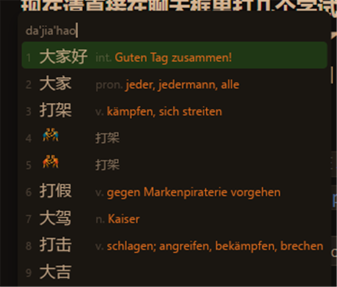

# 青简德语支持（Qingjian German）

[](../LICENSE)
[](NOTICE.md)

给中文拼音输入法 **青简**（[qingjian-team/qingjian](https://github.com/qingjian-team/qingjian)，GPL-3.0）加上
「学习语言 = 德语」的一整套成果：源码改动、**205,333 条**汉德释义表（词库覆盖率 100%、常用义已按英语义项校正，
中文残留与冠词硬错已按 `german-nouns` 逐条复核，词频 ≤100 的 34,739 条又过了一遍**生僻词复核**）、
德语词汇等级表（**171,330 条释义可分级**，运行时查表 100% 命中，0 条盲兜底）、
生成工具（含**个人释义表加词工具**），以及构建 / 部署 / 验证脚本。

装完就是这样（真机候选窗口，在 Edge 里输入 `da'jia'hao`）：



| 输入 | 候选 | 候选旁的德语译文 |
| --- | --- | --- |
| `nihao` | 你好 | `int. Hallo!` |
| `dajiahao` | 大家 | `jeder, jedermann, alle` |
| `dajia` | 打架 | `kämpfen, sich streiten` |
| `dajia` | 打假 | `gegen Markenpiraterie vorgehen` |
| `daji` | 打击 | `schlagen; angreifen, bekämpfen, brechen` |
| `xuexiao` | 学校 | `n. die Schule` |
| `qiche` | 汽车 | `n. das Auto, Wagen, der Kraftwagen, das Automobil, das Kraftfahrzeug` |
| `xin` | 心 | `n. das Herz` |
| `gongli` | 公里 | `n. der Kilometer(km, eine Längeneinheit)` |
| `shuju` | 数据 | `n. die Daten` |
| `jiaotong` | 交通 | `n. der Verkehr, Straßenverkehr` |
| `kaifa` | 开发 | `v. erschließen, abbauen, entwickeln` |
| `nijia` | 你家 | `phr. dein Zuhause` |
| `shengsi` | 生死 | `phr. Leben und Tod` |

## 现在能做什么

- 设置页「学习语言」多出 **德语** 选项，候选词旁显示德语译文（含 ä/ö/ü/ß 等变音符号）
- 词库 92,825 个词 **100% 有德语译文**（补词前只有 43,709 个）
- 名词带定冠词（`der Kilometer` / `das Herz` / `die Daten`），短语标 `phr.`，词性沿用青简的 12 种
- 统计页有 A1 / A2 / B1 / B2 / C1 / C2 生词分级（**171,330 条释义**能定级，A1 28,309 / A2 16,276 / B1 29,479 / B2 38,117 / C1 22,433 / C2 36,716（0 条盲兜底））
- 常用义排在前面：`权利` 是 `das Recht; der Anspruch; die Anwartschaft`（原来只有生僻的 `die Anwartschaft`），
  `便宜` 是 `billig; preiswert; günstig`（原来只有 `geeignet`）——第五轮用英语释义表当第二意见校正了 14,422 条
- 遇到词表里没有、或译得不好的词，**不用重打包**：`german\tools\add_word.py` 直接写个人释义表
  （在仓库根目录运行 `python german\tools\add_word.py 森饰 甜头 --write --reload`），个人表优先于随包表
- **不用换 DLL**：安装自带的旧 TSF DLL 不认识 `German` 枚举，Server 侧按协议版本自动降级（协议 7→8），
  旧 DLL 收到的是「英语」标签 + 德语正文，因此不会丢键、不会打不出汉字
- 全离线：释义表是 mmap 的 `.qj` 容器，启动近零耗时；个人释义表 `user-glossary-de.tsv` 可覆盖任意单条

## 快速开始

以下源码命令默认从仓库根目录执行；「补词流水线」另有工作目录说明。

### A. 已装好支持德语的青简（更新词表）

必须先有支持德语的 `qingjian-settings.exe` 和 `qingjian-server.exe`；上游正式版仅替换词表不会增加「德语」选项。
当前 [Release v0.1.10-dev-german](https://github.com/aolingge/qingjian-german/releases/tag/v0.1.10-dev-german)
只提供 `glossary-de.qj`、`glossary-de.qj.sha256` 和 `levels-de.tsv`，**不包含程序二进制或安装包**。
首次安装请先按 B 构建，并阅读构建记录中的部署步骤。

下载上述三个文件到同一个目录后，在该目录核对释义表校验值：

```powershell
$expected = ((Get-Content -LiteralPath .\glossary-de.qj.sha256 -Raw).Trim() -split '\s+')[0]
$actual = (Get-FileHash -LiteralPath .\glossary-de.qj -Algorithm SHA256).Hash
if ($actual -ne $expected) { throw 'glossary-de.qj 校验失败，请重新下载' }
```

确认校验通过后，按[部署记录](docs/build-and-deploy.md)处理正在占用词表的 Server，
把下载的 `glossary-de.qj` 放到 `<安装目录>\data\generated\`，
可选的 `levels-de.tsv` 放到 `<安装目录>\assets\levels\`（生词分级）；
在 `%APPDATA%\Qingjian\config.toml` 中设置 `learning_language = "de"`。
源码中的文件对应 `german\dist\glossary-de.qj` 和 `german\data\levels-de.tsv`。

个人释义表样例是仓库中的 `german\data\user-glossary-de.tsv`，并非 Release 资产。
可放到 `%APPDATA%\Qingjian\`，但不要覆盖自己已有的个人表；个人表优先于随包表。

### B. 从源码构建

Windows x64 需要 Rust MSVC 工具链、Visual Studio C++ Build Tools 和 Windows SDK；
在 **Developer PowerShell for VS 2022** 中执行。仓库 `.cargo/config.toml` 保留了原构建机器的链接器路径，
下面用 Cargo `--config` 临时覆盖为开发者终端中的 `link.exe`，不修改仓库配置：

```powershell
git clone --branch german https://github.com/aolingge/qingjian-german.git
cd qingjian-german
$env:QINGJIAN_UIACCESS = '0' # 本地未签名测试构建；避免默认 uiAccess=true 导致启动错误 740
cargo --config "target.x86_64-pc-windows-msvc.linker='link.exe'" build --release --target x86_64-pc-windows-msvc -p qingjian-windows-server -p qingjian-windows-settings
```

输出在 `target\x86_64-pc-windows-msvc\release\`；这一步只构建 Server 与设置程序，未安装或注册输入法。
上面的未签名测试构建关闭了 `uiAccess`，在 UWP 宿主中候选窗口可能被遮挡；需要 `uiAccess` 的正式部署需另行处理签名和受信任安装路径。
本机没有 Windows SDK 时的链接配置、x86 TSF DLL 的交叉链接、`mt.exe` 与图标等坑，全部记在
[`docs/build-and-deploy.md`](docs/build-and-deploy.md)（第二、三节）。`german/scripts/` 下的包装脚本保留原机器路径，
使用前需按自己的源码、安装目录和 SDK 路径调整，不能直接当作通用安装器运行。

### C. 验证装好了没

```powershell
$installPath = Read-Host '输入青简安装目录'
pwsh -NoProfile -File .\german\scripts\verify-de.ps1 -Install $installPath -Tools "$PWD\german\scripts" -Kit "$PWD\german\dist\qingjian-de-kit"
```

该命令检查二进制、词表、配置、Server 和候选帧，需要 PowerShell 7；仅检查已有安装，不执行安装或进程重启。
仓库未附带 `qingjian-de-kit` 二进制套件，缺少它时会跳过套件 CLI 检查，并提示不能核对二进制哈希；
不要把含跳过项的结果当作完整验证。以下 CLI 输出是历史示例，不是本次下载后的实测结果：

```
$ qingjian-cli.exe --dict dict.qj --glossary glossary-de.qj --language de --limit 3 -- nihao
加载完成 dict=...\dict.qj entries=92825 glossary=...\glossary-de.qj glosses=205226 english=0 learned=0
   1. 你好    int. Hallo!
   2. 你好好  phr. du gut
   3. 你好像  phr. du scheinst
parse 71µs · lookup 52µs · rank 6.30ms · translate 24µs (43/44 hit) · total 6.45ms
```

从仓库根目录运行 `pwsh -NoProfile -File .\german\scripts\probe-dll.ps1 -Keys xin -Expect Herz -Protocol 7`
会模拟旧 DLL 客户端请求，检查 Server 能否返回 `"language":"English", "text":"das Herz"` 这种降级帧。
它不加载真实 DLL，也不能代替在目标应用中的真机输入验证。

## 数据从哪来

| 文件 | 数据行 | 说明 | 许可 |
| --- | --- | --- | --- |
| `data/glossary-de-final.tsv` | 205,333 | **最终释义表**（UTF-8 无 BOM + LF），`dist/glossary-de.qj` 就是它打的包 | CC-BY-SA-4.0 |
| `data/glossary-de-merged.tsv` | 205,226 | 合并底表（第四轮质检前的状态，供复现） | CC-BY-SA-4.0 |
| `data/glossary-de-art2.tsv` | 204,594 | 加完定冠词的表（底表 157,162 + LLM 补词） | CC-BY-SA-4.0 |
| `data/glossary-de-art.tsv` | 157,162 | HanDeDict 底表 + 冠词第一轮 | CC-BY-SA 3.0 衍生 |
| `data/llm-fill.tsv` | 43,921 | DeepSeek 严格轮（带英语提示） | 生成内容 |
| `data/llm-fill2.tsv` | 3,510 | 放宽轮（数量短语 / 专名 / 无词性兜底） | 生成内容 |
| `data/llm-fill-all.tsv` | 47,432 | 上两轮合并清洗（去掉专名多余冠词 3,762 条） | 生成内容 |
| `data/llm-fill3.tsv` / `llm-fill4.tsv` | 566 / 66 | 短语轮（`phr.`）/ 不给英语提示轮 | 生成内容 |
| `data/llm-fill-phrase.tsv` | 632 | 上两轮合并 | 生成内容 |
| `data/llm-gap.tsv` | 147 | 第四轮：词库里**还没有**德语的词（最后一轮补完，缺口归零） | 生成内容 |
| `data/llm-articles.tsv` | 40,643 | 第四轮：名词首义补 der/die/das | 生成内容 |
| `data/llm-cefr.tsv` | 107,687 | 第四轮：德语实词 → CEFR 等级（Goethe 口径） | 生成内容 |
| `data/llm-audit.tsv` | 14,646 | 第四轮：全表质检提出的修改（合并时只采纳 3,692 条） | 生成内容 |
| `data/apply-report.txt` | 59,382 | 合并落地的每一条改动（含被过滤器拒绝的理由；第四至第八轮） | 生成内容 |
| `data/llm-cefrword.tsv` | 413 | 第七轮：复现式/分词等未定级中心词 → CEFR 等级 | 生成内容 |
| `data/llm-cefrgloss.tsv` | 10,623 | 第七轮：没有可定级实词的条目（型号/符号/短语）→ CEFR 等级 | 生成内容 |
| `data/llm-verify.tsv` | 16,135 | 第八轮：词频 ≤100 的生僻词复核（送审 34,739 条，模型只对「明显不符」的出声） | 生成内容 |
| `data/llm-sense.tsv` | 36,418 | 第五轮：常用义可疑的词 + 建议释义（只采纳词频 ≥100 的 14,422 条） | 生成内容 |
| `data/fixes.tsv` | 162 | 人工核对的硬错修正（谚文残留 4、中文残留 3、缺冠词标签 104、冠词硬错 5 等），优先级最高 | 自制 |
| `data/levels-de.tsv` | 171,330 | A1–C2 等级表（键 = 整条释义小写）；Goethe 5,000 + 分词分级 + 条目分级 + 月份/度量兜底 | MIT + 生成内容 |
| `data/user-glossary-de.tsv` | 10 | 个人释义表样例（`tools\add_word.py` 就写它） | 自制 |
| `dist/glossary-de.qj` | 205,333 | 打包产物，15,510,104 B，sha256 `c869a59e…` | CC-BY-SA-4.0 |
| `data/sources/` | — | HanDeDict、german-nouns、Goethe 5,000 原始数据 | 各自见 `NOTICE.md` |

### 补词流水线

以下历史流水线命令以 `german/` 为工作目录；从仓库根目录先执行 `Set-Location .\german`。
其中 LLM 步骤会调用外部服务，`--write`、`--reload` 与 `-Deploy` 会写入数据或影响本机安装；按需选择，不要整段直接执行。

```powershell
python tools\gap_in_dict.py       # 1. 算缺口：词库 dict.tsv 减德语表 → 48,210 个词没译文
python tools\llm_fill.py          # 2. 严格轮：英语释义当提示，名词强制 der/die/das → 43,921 条
python tools\llm_fill.py --relaxed --skip data\llm-fill.tsv --out data\llm-fill2.tsv        # 3. 放宽轮
python tools\postprocess.py       # 4. 清理 + 合并 → llm-fill-all.tsv
python tools\add_articles2.py     # 5. 冠词二轮：genus 1..4 兜底 + 复数栏 → 修 4,876 行
python tools\llm_fill.py --phrase --skip data\llm-fill3.tsv --out data\llm-fill3.tsv        # 6a. 短语轮
python tools\llm_fill.py --phrase --no-hint --skip data\llm-fill3.tsv --out data\llm-fill4.tsv   # 6b. 照抄英语重试
python tools\merge_glossary.py data\glossary-de-art2.tsv data\llm-fill-phrase.tsv data\glossary-de-merged.tsv
python tools\audit.py             # 7. 体检：重复 / 空释义 / 缺冠词 / BOM / CR
# —— 第四轮（质检 + 等级表）：一个脚本四个阶段，都支持断点续跑 ——
python tools\llm_tools.py gap      --workers 8   # 8. 词库里还没德语的词（本轮补 147 个，缺口归零）
python tools\llm_tools.py articles --workers 8   # 9. 名词首义补冠词 → 40,643 条
python tools\llm_tools.py cefr     --workers 8   # 10. 德语实词 → CEFR → 107,687 条
python tools\llm_tools.py audit --only llm       # 11. 全表质检：只挑「意思明显不符」的 → 14,646 条
python tools\apply_fixes.py --apply              # 12. 四条过滤器合并落地 → glossary-de-final.tsv 205,333 行
python tools\llm_tools.py levels                 # 13. 重建 levels-de.tsv（第四轮口径：165,143 键）
python tools\gaps_now.py data\glossary-de-final.tsv <源码>\assets\lexicon\dict.tsv data\levels-de.tsv   # 14. 体检
# —— 第五轮（常用义修正）：拿英语释义表当第二意见 ——
python tools\llm_tools.py sense  --workers 8     # 15. 只挑「常用义明显不对」的行 → 36,418 条（88,112 词里 41%）
python tools\apply_fixes.py --apply              # 16. 只采纳词频 ≥100 的 14,422 条 → 205,333 行
python tools\llm_tools.py levels                 # 17. 重建 levels-de.tsv（第五轮口径：170,638 键，含月份/度量兜底）
# —— 第六轮（自检修复）：拿 german-nouns 和脚本化体检当裁判 ——
python tools\audit_final.py data\glossary-de-final.tsv data\levels-de.tsv data\gender\nouns.csv   # 18. 十项体检
python tools\apply_fixes.py --apply              # 19. 新增中文残留守卫 + 读 data\fixes.tsv 手工覆盖 44 条
python tools\llm_tools.py levels                 # 20. 重建 levels-de.tsv（170,620 键，定级 100%）
python tools\audit_final.py data\glossary-de-final.tsv data\levels-de.tsv data\gender\nouns.csv   # 21. 复检
powershell -File scripts\pack-glossary.ps1 -Deploy   # 22. 打包并部署（同时部署 levels-de.tsv，旧表自动备份）
# —— 第七轮（等级表去盲兜底 + 十项体检）：让每一条都能凭依据定级 ——
python tools\llm_tools.py levels                 # 23. 先重跑，产出 levels\unknown-heads.tsv / unknown-glosses.tsv 两张待补清单
python tools\llm_tools.py cefrword --workers 8   # 24. 复现式/分词等没等级的 413 个中心词 → llm-cefrword.tsv
python tools\llm_tools.py cefrgloss --workers 8  # 25. 没有可定级实词的 10,623 条（型号/符号/短语）→ llm-cefrgloss.tsv
python tools\llm_tools.py levels                 # 26. 重建 levels-de.tsv（170,619 键，盲兜底 0 条）
python tools\audit_final.py data\glossary-de-final.tsv data\levels-de.tsv data\gender\nouns.csv   # 27. 十项复检
python tools\apply_fixes.py --apply              # 28. 手工覆盖 46 条（新增 2 条排版修正）
powershell -File scripts\pack-glossary.ps1 -Deploy   # 29. 打包并部署
# —— 第八轮（生僻词复核 + 个人表加词工具）：词频 ≤100 的条目也过一遍 ——
python tools\llm_tools.py verify --max-freq 100 --workers 8   # 30. 生僻词复核 → data\llm-verify.tsv（送审 34,739 条 / 1,390 批）
python tools\apply_fixes.py --apply              # 31. 采纳 3,231 条（只做删减的不动 291 条；生僻词不许 DROP）
python tools\audit_final.py data\glossary-de-final.tsv data\levels-de.tsv data\gender\nouns.csv   # 32. 十项复检（CJK 归零）
python tools\llm_tools.py levels                 # 33. 重建 levels-de.tsv（171,330 键）
powershell -File scripts\pack-glossary.ps1 -Deploy   # 34. 打包并部署（sha256 c869a59e…）
python tools\add_word.py 森饰 甜头 --write --reload   # 35. 单条加词/改词走个人释义表，不用重打包
```

`apply_fixes.py` 的过滤器是关键——LLM 质检会顺手动很多**本来正确**的词条
（第四轮抽样里约 15% 的改动是损坏：`艾莎 Elsa → Aisha`、`福瑞 → Furry`）。
现在只有同时满足下面条件才落地，否则在 `apply-report.txt` 里记明拒绝理由：

1. 只把 `der/die/das` 换掉、正文没变的 → 拒绝（冠词表 `add_articles2` 认旧冠词正确时尤其）；
2. 词性（`n.`/`v.`/…）被改的 → 拒绝；
3. 旧、新都是单个拉丁词、且 `difflib` 相似度 < 0.6 的 → 视为臆改专名，拒绝；
4. 与原文一字不差的「复述」→ 直接忽略（第四轮 10,651 条）。

第五轮的「常用义」段另有三条（`apply-report.txt` 里逐条可查）：

5. **词频 < 100 的一律不动**（跳过 16,224 条）：生僻词没有可靠第二意见、错了也没人用
   （代价是连 `憋闷 → bedrückt; beklommen; stickig` 这种合理建议也一起放过）；
6. **只增不删**：新义项里去掉旧表已有的，插到最前，旧义项全部保留——`权利 das Recht` 就是这么补进
   `die Anwartschaft` 前面的；
7. **词性变更必须拿到英语表佐证**：新词性要出现在英语表该词的词性集合里、旧词性不在其中、且词频 ≥1000
   （1,709 条没佐证 → 拒绝；`跟 n. die Ferse → prep. mit; und` 有佐证 → 通过）；
   另外新义项的冠词与冠词表整词命中结果不一致的（`垂水`、共 225 条）一律丢掉。

第六轮的自检又补了两条：

8. **中文残留守卫**：旧正文没有中文、而提案正文里出现 CJK 字样 → 拒绝（拦下 13 条，例如
   `凉凉送 → v. (网络用语) 冷落、忽视`、`者们 → n. die (Plural von 者)`；德语释义里偶尔出现的
   谚文注释是允许的，那 4 条是原表就有的）；
9. **`data/fixes.tsv` 手工覆盖**：优先级高于所有 LLM 提案，用于自检发现后人工核对过的硬错
   （162 条：谚文残留 4 条（`李俊基/李多海/釜山/韩元` 去掉韩文注释）、`本法 → n. dieses Gesetz`、
   104 条 `X → n. Eigenname` 补上性别、5 条冠词硬错（`冷血动物 → der Kaltblüter`、`徭 → der Frondienst`、
   `羊皮纸 → das Pergament`、`鲋 → die Karausche`、`腹足类 → der Gastropode`，均经 `german-nouns` 证实），
   外加第六轮的 41 条冠词与 3 条排版/前缀修正）。

第八轮（生僻词复核）又补了三条，都在 `apply_fixes.py` 里：

10. **复核阶段不做纯删减**：新义项是旧正文的子串且长度 ≥3 → 拒绝（291 条，如 `恪守`、`买卖人`）；
    生僻词条目一律不许 DROP——「删掉」远比「译得糙」糟。
11. **复述不再短路复核**：质检阶段（`llm-audit.tsv`）说「原文没错」时，复核阶段（`llm-verify.tsv`）的发现照样生效
    （`石磨`：audit 认为旧冠词没问题，verify 指出该用 `die Steinmühle`）；
12. **冠词证据链修好了三处长假守卫**（此前 `冠词表否决` 长期 0 次触发）：① `add_articles2.head_token()`
    拿到中心词后必须先剥掉旧冠词再查表，否则 `article_for("das Wegweiser")` 永远只会回「已有冠词」；
    ② 新增 `compound_gender()` 复合词退化（`Steinmühle → Mühle` = die、`Hähnchenflügel → Flügel` = der）；
    ③「只换冠词」规则改成：正文完全相同时才拿名词表作证（`ref == 新冠词` → 采纳，`ref == 旧冠词` → 拒绝），
    换掉整个中心词的改动不再被旧冠词否决（`一揽子 der Geschäftsbereich → das Gesamtpaket`、
    `上标 der Exponent → das Superskript` 曾因此被误杀）。

两个踩过的坑，重跑务必注意：

* **`deepseek-v4-flash` 默认开思维链**：不加 `"reasoning_effort": "none"` 时 token 全烧在 `reasoning_content` 上，
  `message.content` 返回空串、`finish_reason: "length"`。脚本已固定带上这个参数。
* **服务器 mmap 着 `.qj`**：直接覆盖会报 `ERROR_USER_MAPPED_FILE`，要先 `Stop-Process qingjian-server`
  再复制（宿主约 150 ms 后自动重启 Server 并重新 mmap）。

## 目录

```
german/
  README.md                     本文
  CHANGELOG.md                  改动记录
  NOTICE.md                     数据署名与许可细节
  docs/build-and-deploy.md      完整构建 / 部署 / 踩坑记录（要从零重建就看这篇）
  docs/screenshots/             候选窗口截图
  tools/                        生成工具（Python）：缺口统计、补词、加冠词、合并、等级表、体检、生僻词复核、个人表加词
  scripts/                      构建、部署、体检、协议探针、OCR 脚本
  data/                         释义表 / 等级表 / 补词中间产物 / 上游原始数据
  dist/glossary-de.qj           打包好的释义表，直接拷进 <安装目录>\data\generated\
  patch/qingjian-german.patch   相对上游 40e3e55 的完整改动
```

## 源码改动（`german` 分支）

15 个文件、+156 / −19 行，全部在上游 `40e3e55` 之上：

- `crates/qingjian-core/src/candidate/language.rs`：`Language::German`（`de` / `de-DE` / `german` / `deutsch`）
- `crates/qingjian-platform/src/protocol/mod.rs`：`PROTOCOL_VERSION` 7 → 8
- `apps/windows/server/src/dispatch/composed/mod.rs`：`downgrade_for_old_dll` 把德语记号降级成英语，保住旧 DLL
- `apps/windows/{server,settings}/build.rs`：图标路径按 `CARGO_MANIFEST_DIR` 解析
- `apps/cli`、`apps/macos`、`apps/linux`：语言列表与文案补德语
- `crates/qingjian-predict/src/gloss/prompt.rs`：德语释义提示词（云联想用）
- `.cargo/config.toml`、`scripts/`：本机没有 Windows SDK 时的链接配置与构建包装

完整 diff 见 `patch/qingjian-german.patch`。

## 已知限制

- **协议版本变了**：德语记号让 `PROTOCOL_VERSION` 从 7 升到 8。老 DLL 靠 Server 侧降级仍可用，
  但如果你自己改了协议，请同步重编并注册 TSF DLL（`docs/build-and-deploy.md` 第五节）。
- **CEFR 分级：每条释义都能定级，没有盲兜底**。等级表的键是整条释义的小写文本（精确匹配），表里 171,330 条，
  运行时查表命中 100%（205,333 行一行不落，含 `M. Night Shyamalan` 这种量词前缀）。第七轮把最后
  11,647 条「没有可靠依据就按 B2/A1 兜底」的条目清掉了：其中 413 个中心词（复现式 `gegessen`、分词
  `entschlossen`）和 928 条整条目（`nach und nach`、`als ob`、`Eigenname`）交给模型按条目定级，剩下的
  10,188 条是纯数字/型号/符号释义（`1 (Num)`、`Typ 99`、`〡〢〣`），释义里没有任何德语词汇可学，一律按 A1。
- **名词大小写只能人工抽查**：德语形容词跟在冠词后面本来就小写（`ein kleiner Teil`、`die drei Punkte`），
  而 `german-nouns` 把 `Klein`/`Für`/`Alt` 这类专名也收成名词，所以「小写词 ∈ nouns.csv」这种自动判定
  全是假阳性。现在只做一条确定性的对照：冠词后的小写外来词（英语词条）——复检为 0 处，
  此前发现并修好的 `U盘 → der Memory Stick` 已在手工覆盖表里。
- **名词首义里还有 15,610 条没有定冠词**：剩下的是日期（`12月25日 → 1. Weihnachtsfeiertag`）、
  数量（`5分钟`）、技术复合词（`8通道双向数据耦合器`）——这些本来就不该加 `der/die/das`。
- **词库覆盖率已经是 100%**：`dict.tsv` 92,825 个词条全部有德语译文（第四轮补完 147 个缺口词，
  最后一个 `阜新市 → die Stadt Fuxin` 也在里面）。
- **40,095 行没有词性前缀**（`10月11日 → 11. Oktober`）：这是 HanDeDict 原生就有的写法，青简按
  「整段就是释义」处理，不影响释义显示与定级，加词性反而会写错。
- 语料是词典式的，**不是逐句翻译**；生成词条（`llm-fill*.tsv`、`llm-*.tsv`）没有人工逐条校对。
  第五轮已经用英语表校正了 14,422 条常用义，第六轮又用 `german-nouns` 复核了冠词，第八轮再把**词频 ≤100 的
  34,739 条生僻词**整体送模型复核了一遍（回来 16,135 条，采纳 3,231 条）——但模型对「它也不确定」的条目
  按约定不出声（`llm_tools.py verify` 的提示词是「宁漏勿错」），所以**生僻词仍有取错义项的可能**
  （例如 `都会` 被当成「大都市」而不是「都 + 会」）。想改单条，用 `tools\add_word.py` 最快。

## 许可与署名

- 本仓库是 **qingjian** 的 fork，源码部分沿用上游 **GPL-3.0**（见根目录 `LICENSE`）
- 释义表由 [HanDeDict](https://github.com/gugray/HanDeDict)（CC-BY-SA 3.0）与
  [german-nouns](https://github.com/gambolputty/german-nouns)（CC-BY-SA 4.0）衍生，
  另有 48,064 条由 DeepSeek 生成 → `german/data/glossary-de*.tsv` 与 `german/dist/glossary-de.qj`
  **按 CC-BY-SA-4.0 发布**，署名细节见 `german/NOTICE.md` 与词表 META
- Goethe-Institut 5,000 词表：MIT

## 本机专用说明

`scripts/cargo-config.this-machine.toml` 与 `.cargo/config.toml` 里的绝对路径（`E:\codemain\…`、
MSVC 版本号、`linkwrap.cmd`）只对制作这台机器有效，是为了在**没装 Windows SDK** 的情况下把
x64 三件套和 x86 TSF DLL 都链出来。换机器要先看 `docs/build-and-deploy.md` 第二、三节。
